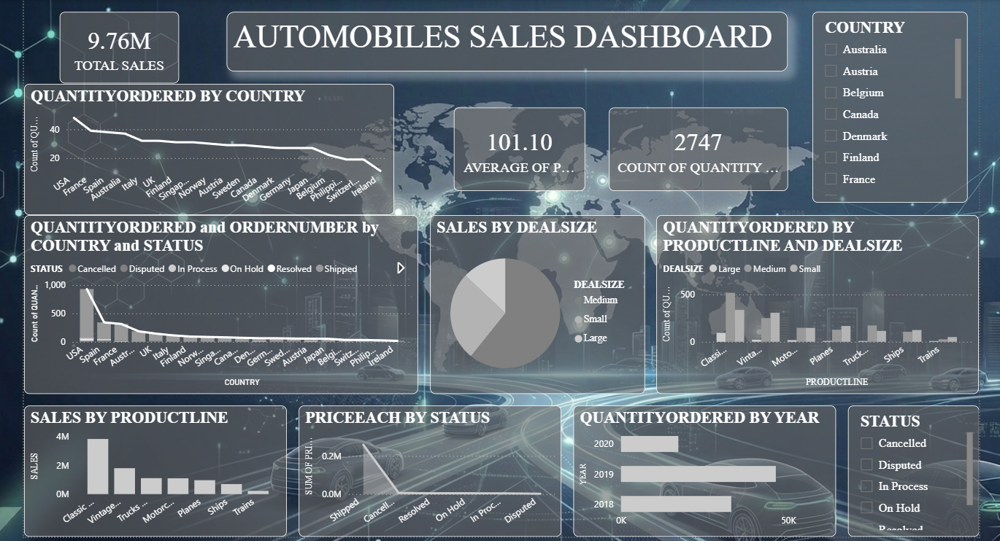

<h1 align="center"> Automobile Sales Dashboard (Power BI)</h1>

  <b>Power BI Project | Sales Analytics | Business Analytics</b>

<h2> Overview</h2>

This project focuses on building an interactive <b>Automobile Sales Dashboard</b> using <b>Power BI</b> to analyze sales performance across different markets. 
It highlights key business metrics such as revenue, product demand, and order distribution to support strategic decision-making.

<h2> Business Problem</h2>

Organizations often struggle to track sales performance across regions and product categories. 
This dashboard addresses that challenge by providing a centralized view of sales data, helping stakeholders identify trends, optimize operations, and improve profitability.

<h2> Dashboard Highlights</h2>

  

<ul>
  <li>Revenue tracking across multiple countries</li>
  <li>Comparison of deal sizes and their contribution to sales</li>
  <li>Product line analysis to identify top-performing categories</li>
  <li>Order status breakdown for operational insights</li>
  <li>Year-over-year sales trend visualization</li>
</ul>

<h2> Analytical Approach</h2>
<ul>
  <li>Cleaned and transformed raw data using Power Query</li>
  <li>Created calculated measures using DAX</li>
  <li>Designed relationships between multiple data fields</li>
  <li>Built interactive visuals for better data exploration</li>
</ul>

<h2> Technology Stack</h2>
<ul>
  <li><b>Power BI</b> – Dashboard creation and data modeling</li>
  <li><b>DAX</b> – Calculations and measures</li>
  <li><b>Power Query</b> – Data preprocessing</li>
</ul>

<h2> Insights Generated</h2>
<ul>
  <li>Mid-sized deals drive a significant portion of total revenue</li>
  <li>Sales concentration is higher in specific geographic regions</li>
  <li>Product demand varies significantly across categories</li>
  <li>Completed (shipped) orders dominate revenue contribution</li>
</ul>

<h2> Key Functionalities</h2>
<ul>
  <li>Interactive filtering (Country, Status, Deal Size)</li>
  <li>KPI indicators for quick performance monitoring</li>
  <li>Dynamic charts for trend analysis</li>
  <li>User-friendly and intuitive dashboard layout</li>
</ul>

<h2> Getting Started</h2>
<ol>
  <li>Download the <b>.pbix</b> file from this repository</li>
  <li>Open it using <b>Power BI Desktop</b></li>
  <li>Explore the dashboard using available filters</li>
</ol>

<h2> Repository Structure</h2>
<pre>
automobiles-sales-dashboard
│── automobiles_sales_dashboard.pbix
│── automobiles_sales_dataset.xlsx
│── automobile_sales_dashboard.png
│── README.md
</pre>

<h2> Author</h2>

<b>Anjana C</b> 
Aspiring Data Analyst passionate about transforming data into actionable insights

⭐ Star this repository if you found it insightful!

